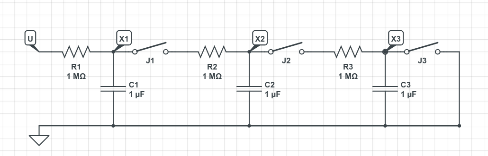

# A TAKE HOME LAB for low-cost control engiennering teaching

## Information
This project shows how to implement linear controllers and observers using the Arduino platform on low-cost electrical plants.  

The Arduino platform was chosen because it is very common and widely available, providing an accessible environment for rapid prototyping and validation of control strategies. This allows students and researchers to design, test, and evaluate linear control algorithms in a practical and inexpensive way. 

This project is released as open-source software under the GNU General Public License v3 (GPLv3), ensuring that it can be freely used, modified, and shared under the same license terms.

Special thanks to all the members of the Departamento de Control, FIME-UANL.  

## Table of Contents
* [Description of the Hardware Used](#Hardware)
* [Mathematical Model](#Mathematical)
* [Design of Controllers and Observers](#Design)
* [Description of the Software Used](#Software)

## Hardware
The control/observation algorithm is carried out on the Arduino UNO R3 platform, electrical plants made from R, C or L elements are considered. All components can either be assembled on a breadboard or a custom shield can be fabricated using the PCB designs provided in this repository /src/PCB/. The estimated total cost of the hardware is approximately **$25–35 USD**, depending on the source of components.

A description of the hardware used is shown in the following figure.

The basic design consists of three main elements: the control unit, the user interface unit, and the plant to be controlled. Next each element is described. 

### The MCU board as a control unit

The Arduino UNO R3 platform was chosen as control unit to elaborate the custom shield, however any other platform may be used. For breadboard design we recomend to use the Arduino Nano instead. The following inputs and outputs are used. The requiered pins for plan conection are highlighted with *, all the other pins are optional. 

#### Analog Outputs (PWM)
* **Pin 5.*** Control signal, denoted as U in the software and as $u_{i}(t)$ in the algorithm description.

#### Analog Inputs 
* **A0.*** Reference signal denoted as R in software.
* **A1.*** Process signal 1 denoted as X1 in software.
* **A2.*** Process signal 2 X2 denoted as X2 in software.
* **A3.*** Process signal 3 X3 denoted as X3 in software.

#### Digital Inputs
* **Pin 2.*** Start input, denoted as START in the software.  
* **Pin 3.*** Stop input, denoted as STOP in the software.  
* **Pin 6.** Toggle input, denoted as TOG1 in the software.  
* **Pin 7.** Toggle input, denoted as TOG2 in the software.  
* **Pin 8.** Toggle input, denoted as TOG3 in the software.  

#### Digital Outputs
* **Pin 9.** LED indicator for system activated, denoted as LED9 in the software.  
* **Pin 10.** LED indicator for system deactivated, denoted as LED10 in the software.
* **Pin 11.** LED indicator for system deactivated, denoted as LED11 in the software.

### I2C Led display
* **SCL.** clock for I2C communication with on board display, denoted as SCL in the software.  
* **Pin 9.** data for I2C communication with on board display, denoted as SDA in the software.  

### Serial
* **Pin 0.** UART RX for PC communication.  
* **Pin 1.** UART TX for PC communication.

### The plant

Several plants can be used. Any SIMO plant with 1 input and 3 outputs can be connected to the board. The main shield enrgizes the plant with 5V and conects its input and 3 outputs,all the connections are made through female headers in the main shield.

#### The RC-RC-RC plant

The folder `/src/PCB/RC-RC-RC` contains the PCB design of an RC-RC-RC plant, consisting of three RC filter stages connected through jumpers **J1** and **J2**.  

#### Parts list:

- 3 resistors of 1 MΩ (**R1**, **R2**, **R3**)  
- 3 capacitors of 1 μF (**C1**, **C2**, **C3**)   
- 3 jumpers (**J1**, **J2**, **J3**)  

#### Schematic diagram:

The schematic diagram for the RC-RC-RC plant is


In the schematic, U represents the pin 10 as the plant control input; while X1, X2 amd X3 represent process variables which are meassured through pins A1, A2 and A3 respectively.

####  Jumper configurations

Four different systems may be implemented depending on the jumper configuration (**J1**, **J2**, **J3**). **J1** and **J2** connect the RC stages, while **J3** bypasses the third capacitor **C3** to ground.

#####  

| Case | J1 | J2 | J3 | System order   | Transfer function | Relation Output/Input for G(s) | 
|------|----|----|----|----------------|------------------|-------------|
| a) | 0  | X  | X  | First order    | G(s) = 1 / (s + 1)  | G(s) = X1(s) / U(s) |
| b) | 1  | 0  | X  | Second order   | G(s) = 1 / (s^2 + 3s + 1)  | G(s) = X2(s) / U(s) |
| c) | 1  | 1  | 0  | Third order    | G(s) = 1 / (s^3 + 5s^2 + 6s + X)  | G(s) = X3(s) / U(s) |
| d) | 1  | 1  | 1  | Second order   | G(s) = 1 / (s^2 + 4s + 3)  | G(s) = X2(s) / U(s) |

##  Mathematical model

Next the mathematical models for some jumper configurations are shown. 

###  Case a) First order  **J1**=0, **J2**=X, , **J3**=X

The pin 10 is the input to the plant, and the output of the first RC network (pin A1) its output. All the other networks are disconnected.  

In this case The transfer function from U (pin 10) to Y (pin A1) is given by:
```math
\begin{equation*}
  G(s) = \frac{1}{R_1C_1 s + 1} 
\end{equation*},
```
The state-space model is given by:
```math
\begin{eqnarray*}
  \dot{x}_1 (t)  & = &  -\frac{1}{R_1C_1}x_1(t) +  \frac{1}{R_1C_1}u(t),  \\ 
  y(t) & = & x_1(t),
\end{eqnarray*}
```
where X1 represents the voltage at **C1**.

###  Case b) Second order  **J1**=1, **J2**=0, , **J3**=X

The pin 10 is the input to the plant, and the output of the second RC network (pin A2) its output. All the other networks are disconnected.  

In this case The transfer function from U (pin 10) to Y (pin A2) is given by:
```math
\begin{equation*}
  G(s) = \frac{\frac{1}{R_1 R_2 C_1 C_2}}{\Biggl( s^2 + \left( \frac{1}{R_1 C_1} + \frac{1}{R_2 C_1} + \frac{1}{R_2 C_2} \right) s + \frac{1}{R_1 R_2 C_1 C_2} \Biggr)}
\end{equation*},
```
and the state-space model is given by:
```math
\begin{eqnarray*}
  \left[\!\!\begin{array}{l}\dot{x}_{1}(t) \\ \dot{x}_2 (t) \end{array}\!\!\right] & = &  \left[\!\!\begin{array}{cr}-\frac{1}{R_1C_1}-\frac{1}{R_2C_1} & \frac{1}{R_2C_1} \\ \frac{1}{R_2C_2} & -\frac{1}{R_2C_2}\end{array}\!\!\right]\!\!\left[\begin{array}{l}x_{1}(t) \\ x_2(t) \end{array}\!\!\right]\!\!+\!\!\left[\!\!\begin{array}{c}\frac{1}{R_1C_1} \\ 0 \end{array}\right]u_i(t), \\ 
  y(t) & = & \left[\begin{array}{cc}0 & 1\end{array}\right]\left[\begin{array}{c}x_{1}(t) \\ x_2(t) \end{array}\right],
\end{eqnarray*}
```

where X1 represents the voltage at **C1** and X2 represents the voltage at **C2**.

###  Case c) Third order  **J1**=1, **J2**=1, , **J3**=0

The pin 10 is the input to the plant, and the output of the third RC network (pin A3) its output. All the other networks are disconnected.  

In this case The transfer function from U (pin 10) to Y (pin A3) is given by:

The state-space model is given by:

where X1 represents the voltage at **C1**, X2 represents the voltage at **C2**, and X3 represents the voltage at **C3**.

###  Case d) Second order, second case  **J1**=1, **J2**=1, , **J3**=1

The pin 10 is the input to the plant, and the output of the third RC network (pin A3) its output. All the other networks are disconnected.  

In this case The transfer function from U (pin 10) to Y (pin A3) is given by:

The state-space model is given by:

where X1 represents the voltage at **C1**, X2 represents the voltage at **C2**, and X3 represents the voltage at **C3**.

## Software

#### Main Routine
The `loop()` routine runs cyclically and serves as the main routine. It performs input processing, state estimation, system control, output processing, PC communications, and uniform sampling control. The `observador()` and `control()` functions implement the algorithms described in the **Design** section, while the rest of the functions handle IO, serial communication, and uniform sampling control.  
```cpp
// ******************************************************** //
//---------- Rutinia principal  --------//                  //
// ******************************************************** //
void loop() {                     
  proc_entradas();                    // Procesamiento de Entradas
  observador();                       // Observador
  control();                          // Control
  proc_salidas();                     // Procesado de Salidas
  coms_arduino_ide();                 // Comunicaciones
  //coms_python(&Rw,&Y,&U);
  espera();			      // Muestreo uniforme
}
```


Control Routines

This routine implements the state feedback described in the Design/Coordinate Transformation Solution section. It uses the states estimated by the observer, and the term Kp*R to track the reference.
```cpp
void control(){
  // Control
  U = Kp*R - K1*XeR1 - K2*XeR2 - K3*XeR3;       // Ley de control retro estado estimado
   
  // Saturation to [0, 5]
  if(U >= 5.0) U = 5.0;               // Saturacion de control en rango 0 a 5V                      
  else if(U < 0) U = 0;
}
```

Observer Routines

A Luenberger observer is implemented as described in Design/Luenberger Observer. Euler’s method is used to implement the integrators. The dynamics to integrate are expressed in the functions f1 and f2. The model matrices A, B, C and gains H1, H2 were calculated in the setup routine `setup()`.
```cpp
void observador(){
  // Obs dynamic
  float f1 = Am11*XeR1 + Am12*XeR2 + Am13*XeR3 + Bm1*U + H1*(Y-XeR3);     
  float f2 = Am21*XeR1 + Am22*XeR2 + Am23*XeR3 + Bm2*U + H2*(Y-XeR3);
  float f3 = Am21*XeR1 + Am22*XeR2 + Am33*XeR3 + Bm3*U + H2*(Y-XeR3);     

  // Euler
  float XeN1 = XeR1 + Tseg*f1;              
  float XeN2 = XeR2 + Tseg*f2;              
  float XeN3 = XeR2 + Tseg*f3;              
  XeR1 = XeN1;
  XeR2 = XeN2;
  XeR3 = XeN3;
}
```

